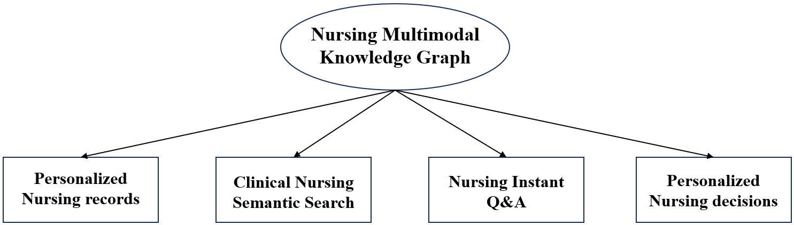

# NMKG
<div align="center">

<h1> Precision Nursing Research Based on Multimodal Knowledge Graph </h1>

<div>
    <p> <b>Shenzhen People's Hospital</b> </p>
</div>


</div>

## Introduction

This project mainly focuses on introducing the multimodal knowledge graph we have developed in the field of nursing (Nursing Multimodal Knowledge Graph, NMKG). We have open-sourced of the **code and database** to facilitate further research by others.

The establishment of NMKG effectively integrates various types of data, including clinical databases, nursing training databases, and internet data. The NMKG contains more than 60,000 entities and 300,000 relationships.

## Overall

We have constructed a MKG in the nursing domain, centered around patients and diseases, with nursing issues, nursing techniques, nursing assessments, and disease symptoms as focal points, comprising a total of 62,909 entities and 330,285 relationships. 

Nursing knowledge is represented and stored through knowledge triplets, namely **(head entity, relationship, tail entity)***.

eg.(Disease, has_nurse, Nursing_Technique), (Patient, has_profile, Profile), ...

 

 The entities encompass 17 types, including patients, diseases, examinations, medications, nursing techniques, nursing procedures, nursing assessments, nursing measures, images, videos, and more. 
 
 The relationships consist of 20 types, such as drugs_of, has_assessment, has_disease, has_profile, has_symptom, and others. Table 1 presents statistics on the number of entities and relationships in this NMKG.

 | Entities | Quantity | Relationships | Relationships | 
|-------------|-------------|-------------|-------------|
|Patient|	100	|belongs_to|	8864|
|Profile|	2054	|cure_way	|21050|
|Check	|3353|	acompany_with|	12029|
|Cure	|544|	common_drug|	14649|
|Disease	|8808	|do_eat	|20238|
|Symptom	|5998	|drugs_of	|17315|
|Drug	|3828	|has_assessment|	709|
|Nursing_Operation	|3929	|has_disease|	132|
|Nursing_Technique	|192|	has_measures|	728|
|NursingAssessment	|709	|has_nurse	22053|
|Department	|54	|has_operation|	960|
|Food	|4870	|has_picture|	7705|
|NursingMeasure|	728|	has_problem|	756|
|NursingProblem	|128	|has_profile|	1276
|Producer	|12701	|has_symptom	|54717
|Video	|7208	|has_video|	7208|
|Picture	|7705|	need_check|	39423|
|	|	|no_eat|	22247|
|	|	|recommand_drug|	57990|
|	|	|recommand_eat|	20236|
|Total: 62909|	|Total: 330285| |

---Our **Nursing Multimodal Knowledge Graph**.

 

## Implemented features

--We have implemented the following functions using the NMKG：

 - [x] Construction of Personalized Patient Care Profiles
 - [x] Clinical Nursing Semantic Search
 - [x] Clinical Nursing Instant Question-Answering
 - [x] Personalized Nursing Decision-Making

 


 
<div align="center">
 <div>
    <p> <b>Clinical Nursing Semantic Search</b> </p>
 </div>
</div>

 

<div align="center">
 <div>
    <p> <b>Clinical Nursing Instant Question-Answering</b> </p>
 </div>
</div>


## Datasets
### Project catalog
```shell
G:.
│  build_json.py
│  build_medicalgraph.py
│  build_medicalgraph_from_json.py
│  requirement.txt
│
├─Data_processing
│      create_word2vec_input.py
│      create_word_table.py
│
├─KNN_predict
│      classifier.py
│      create_vec.py
│      neo_models.py
│      nursing_class.py
│      predict.py
│      read_csv.py
│      text_fasttext.py
│
├─MyCrawler
│  └─MyCrawler
│      │  items.py
│      │  middlewares.py
│      │  pipelines.py
│      │  settings.py
│      │  __init__.py
│      │
│      ├─data
│      └─spiders
│              medical_pedia.py
│              nur_pedia.py
│              __init__.py
│
└─NursingData
    │  disease_picture.xlsx
    │  disease_video.xlsx
    │  nurse_technique.xlsx
    │  NursingAssessment010.xlsx
    │  NursingMeasure010.xlsx
    │  NursingProblem010.xlsx
    │  Nursing_graph.xlsx
    │  Nursing_graph01.xlsx
    │  patent-disease.xlsx
    │  patient01.xlsx
    │  Relation.xlsx
    │  yanke-nurse.xlsx
    │
    └─dict
            check.txt
            deny.txt
            department.txt
            disease.txt
            drug.txt
            food.txt
            Nurse care technology.txt
            producer.txt
            symptom.txt
```
Knowledge Graph Data:
 - *entities.dict*: a dictionary map entities to unique ids
 - *relations.dict*: a dictionary map relations to unique ids
 - *train.txt*: the KGE model is trained to fit this data set
 - *valid.txt*: create a blank file if no validation data is available
 - *test.txt*: the KGE model is evaluated on this data set

<h2 id="1"> Quick Start</h2>

<h3 id="1-1">Environment Configuration</h3>

*KnowLM* supports both **manual** and **docker image** environment configuration, you can choose the appropriate way to build.
#### 🔧Manual Environment Configuration
```shell

conda create -n knowlm python=3.8 -y

conda activate NMKG
pip install torch==1.13.1+cu116 --extra-index-url https://download.pytorch.org/whl/cu116

pip install -r requirements.txt
```
#### 🐳Building With Docker Images
```shell
docker pull zjunlp/knowlm:v.1
docker run -it zjunlp/knowlm:v.1 /bin/bash
```


## Citation

If you use the codes and datasets , please cite the following paper(not published yet).

```

```
